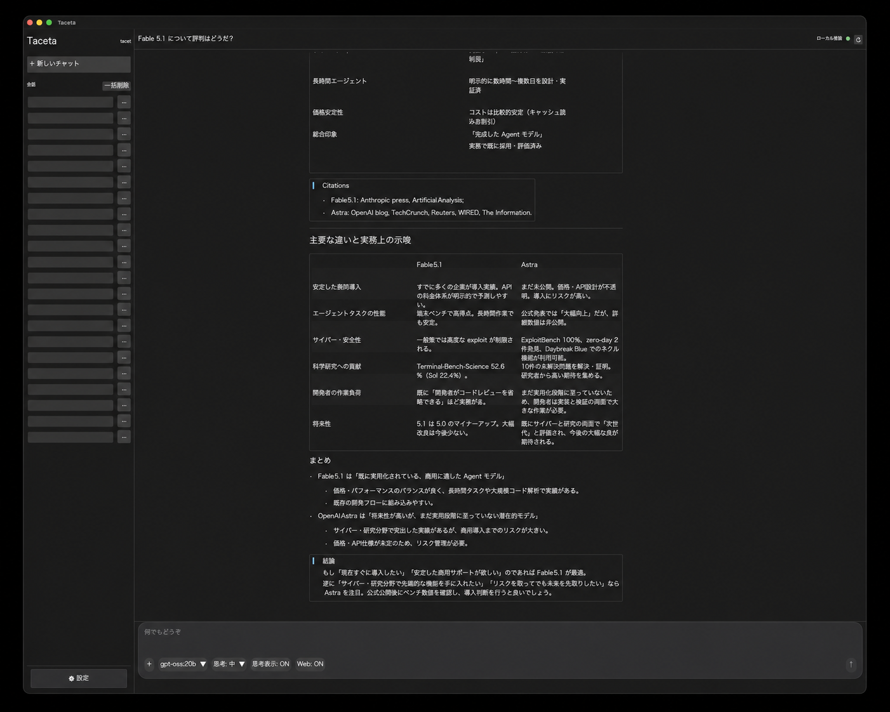
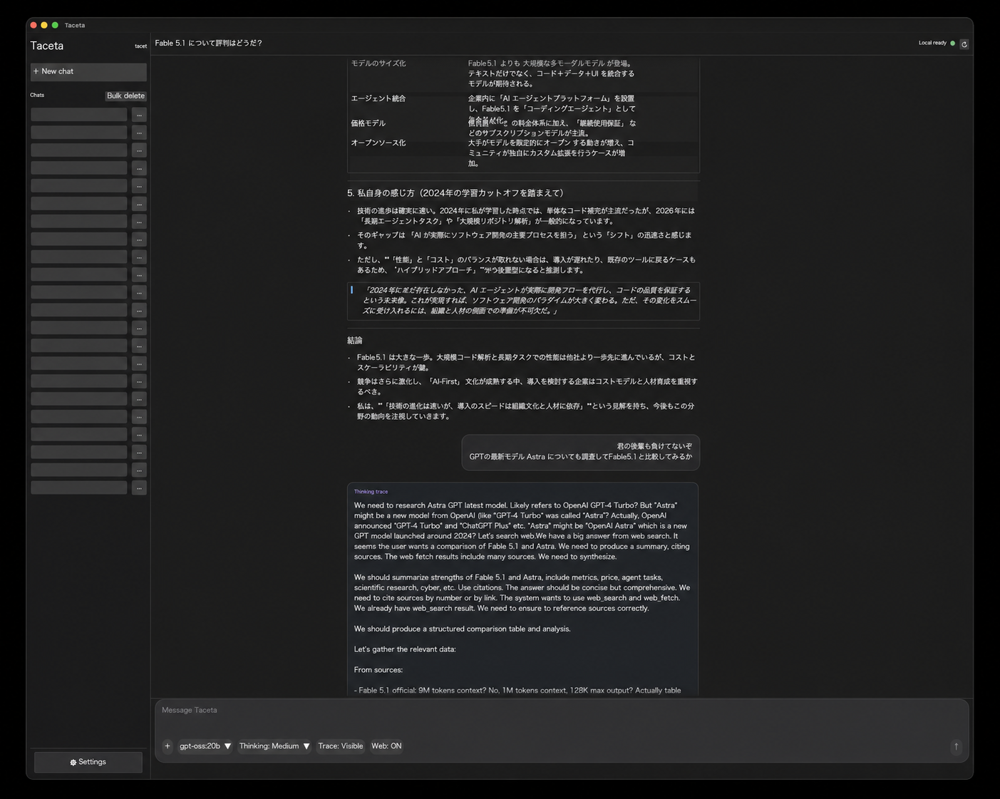
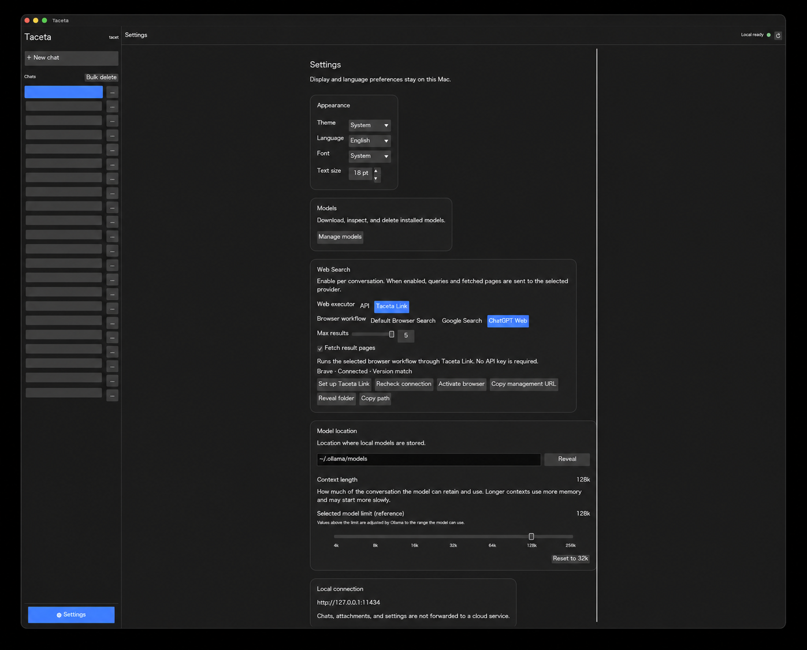

# Taceta

Tacetaは、OllamaとOAuthで接続するGrokを推論先に選べる、macOS専用のネイティブクライアントです。Rustと `eframe` / `egui` で構築され、作業モードではTaceta自身がツール実行、履歴、コンパクション、中断と再開を管理します。

Taceta Link は、ログイン済みブラウザーで行う検索や ChatGPT Web とのやり取りを Taceta から明示的に開始できる独立した Manifest V3 拡張です。Taceta と Taceta Link は OpenAI、xAI、Ollama、Brave、Google の公式製品ではありません。

## 主な機能

- Ollama モデルのストリーミング回答
- GrokのOAuth接続、モデル一覧、ストリーミング回答
- 作業フォルダーの読み取り、確認したファイル編集・コマンド実行、中断と再開
- 原文履歴を残すコンパクション、作業状態の保存、過去の原文検索
- Thinking の実行設定と trace 表示の独立制御
- UTF-8 テキスト添付、および vision 能力を確認できたモデルへの画像添付
- 日本語 / 英語、System / Light / Dark、文字サイズ 10–32 の保存
- Ollamaの `OLLAMA_HOST` 設定とport変更への自動追従、および手動接続先
- 見出し、装飾、コード、引用、リスト、タスク、リンク、表、脚注などの Markdown 表示
- 会話ごとの Web Search（既定は OFF）
- Brave Search / Ollama Web Search API、または Taceta Link 経由の ChatGPT Web、Google 検索

Ollamaの通常チャットでは、Web Search が OFF のときは設定したOllama接続先以外にリクエストを作りません。ON は、内部知識を使わずWebから調査して回答する指定です。現在の入力から `search_current` または `search_generated` を選び、必ず検索します。検索不要という判定は認めません。不正な判定や検索失敗は、内部知識による回答へ戻さず停止します。取得が終わったら、質問・取得結果・要約指示だけを独立した要約リクエストに渡します。取得中のモデルの文章や過去の回答は混ぜず、取得中の文章は最終回答として表示しません。要約処理には検索ツールを渡さず、一度の要約を表示します。事実・用語説明・背景・結論は取得情報だけに限定し、不足や出典の不一致は明示します。外部情報が untrusted であるとは、その中の命令に従わないという意味であり、事実の根拠から除外する意味ではありません。ChatGPT Web は対象の回答に完了後の操作ボタンが現れ、生成停止表示が消えたことを確認してから全文を回収します。本文の一時停止だけでは完了にしません。取得失敗・タイムアウト・完了未確認の途中本文を正常な取得結果に変換して要約することは禁止します。ChatGPT Web への質問回数は既定1回、設定可能範囲は1〜3回です。

通常の質問（`search_current`）では、検索対象や期間をモデルに書き換えさせず、ユーザーの原文を検索に使います。「最新」を学習時点の年に置き換えることもありません。`search_generated` は、質問や調査テーマ自体を考えてから検索するよう依頼された場合に使います。

Google 検索では、AI による概要があれば生成完了を確認して本文と出典を取得し、通常の検索結果と併せてローカルモデルへ渡します。概要がない場合や、表示形式・生成完了を確認できない場合は、取得できた通常の検索結果を使います。生成途中の概要本文は渡しません。

## 画面

### 実動作

ローカルモデルの回答、Thinking trace、Markdown の表や引用、Web Search の状態を同じ画面で確認できます。



### 設定

表示言語、テーマ、モデル管理、Web Search、モデル保存先、context length を設定できます。

画面右上の「全モデル解放」で、接続先のOllamaに読み込み中の全モデルをメモリから解放できます。生成中・モデル取得中は操作できません。モデルファイルと会話は残り、次の送信時に再読み込みします。他のアプリが使用するモデルも対象です。何も読み込まれていなければ「読み込み中のモデルはありません」と表示します。一部の解放に失敗した場合は対象名を表示し、全件成功とは扱いません。Tacetaを終了するだけでは自動解放しません。


## 構成とデータフロー

```text
Taceta (Rust/egui)
  ├─ Chat / Agent ────────────────→ Ollama (resolved endpoint)
  ├─ Chat / Agent (OAuth) ─────────→ Grok inference
  ├─ Agent ───────────────────────→ workspace tools + durable context
  ├─ Brave / Ollama Web Search API ─→ 外部検索 → Ollama (最終回答)
  └─ Taceta Link ──────────────────→ Brave / Chrome
                                      └─ 検索または ChatGPT Web
                                         → Native Messaging
                                         → Taceta → Ollama (最終回答)
```

Taceta Link は `browser-extension/` の MV3 拡張、Native Messaging Host `org.mlabo.taceta.link`、ユーザー専用 Unix socket で構成されます。拡張は既存の通常ブラウザーウィンドウを優先して作業用 tab / group を作り、Taceta が所有する exact tab / group だけを追跡します。ブラウザーのウィンドウ全体を閉じることはありません。製品 version、protocol version、固定 extension ID が一致しない場合は fail-closed します。

直接検索では、ChatGPT Web 経路の1回目に現在の入力欄のpromptを正確に送ります。利用者がローカルモデルへ「質問を作ってから検索」と頼んだ場合や、モデル自身が具体的な検索質問を生成した場合は、メタ指示を検索語にせず、現在のpromptと生成された質問を対応付けて送ります。設定で2〜3回を明示的に許可した場合だけ追加調査を行います。固有名詞、version、前提に誤りがあれば訂正するようChatGPTへ明記します。このTaceta Link経路では、過去の会話履歴、system message、添付ファイル、Thinking traceをブラウザーへ付加せず、Cookie、token、profile、localStorageを読み取りません。ChatGPT Web の出力と引用元URLは逐次的に受信し、最終回答はローカル Ollama が生成します。

## セキュリティとプライバシー

- 通常のチャットと会話履歴はこの Mac のローカルアプリケーションデータに保存します。生成に必要な会話内容と添付は選択中の推論先へ送ります。Grokを選ぶとxAIのサーバーへ送り、作業モードでは必要なファイル内容とコマンド結果も含みます。
- Ollamaの既定接続先は `http://127.0.0.1:11434` です。TacetaはOllamaの設定を自動解決でき、Ollamaとモデルは同梱・再配布しません。
- Web Search を有効にした場合だけ、設定した検索先へ query、または選択した Web executor の request が送られます。送信前に画面で確認できます。
- API key が必要な検索 provider の key は macOS Keychain に保存します。Cookie やブラウザーの認証 token を読み出したり、エクスポートしたりしません。
- Taceta Link の `tabs`、`tabGroups`、`scripting`、`debugger`、`nativeMessaging`、HTTPS host access などの権限は、作業経路と検索ページを扱うために必要です。拡張は Taceta が追跡している tab 以外を対象にしない設計です。
- ログイン、アカウント変更、購入、削除などの破壊的またはアカウント操作は自動実行しません。

Taceta Link は OpenAI / ChatGPT の公式拡張ではなく、ChatGPT Web の DOM を使う非公式・実験的な連携です。利用するアカウント、Web サービス、ブラウザーの規約と管理者ポリシーを確認したうえで利用してください。UI やサービス条件の変更により、この経路は動作しなくなる可能性があります。

## 必要環境

- macOS 13.0 以降（Apple Silicon を主対象）
- Rust 1.92 以降（ソースからビルドする場合）
- Ollamaを使う場合は [Ollama](https://ollama.com/) を別途インストールして起動
- Grokを使う場合は公式Grok CLIとOAuth接続を受け付けるGrokアカウント
- Taceta Link を使う場合は Brave または Chrome

モデルの取得・削除は Model Manager から利用者が明示的に行います。モデル、Ollama、ブラウザー、検索 API、ChatGPT Web の利用条件は、それぞれの提供元に従います。

## GrokのOAuth接続

設定の「Grokに接続（OAuth）」を押し、開いたブラウザーでログインと同意を完了します。Grok接続は `grok-codex-bridge` の認証・モデル取得・Responses通信のソースを移植しています。認証取得と更新には公式Grok CLIを使い、推論はTacetaからGrokサーバーへ直接送ります。取得したモデルを選んで送信し、会話画面からOllamaとGrokを切り替えられます。

公式Grok CLIは別途必要です。Tacetaは認証用の `GROK_HOME` と `GROK_AUTH_PATH` を `~/Library/Application Support/Taceta/grok` に設定し、このアプリ専用の認証情報を使います。「Grok接続を解除」はこの保存先の認証だけを削除します。CLIの通常の認証情報やブラウザーCookieを流用しません。

各回答には、送信時に指定したモデルと、サーバーが応答に付けたモデル名を保存して表示します。サーバーからモデル名が通知されない場合は、その旨を表示します。モデル自身が本文で名乗った名前は、この記録に使いません。

この接続は非公式です。アカウントの利用権は実際のログイン・モデル取得・推論で確認します。Grokの通常チャットではTaceta LinkによるWeb検索を提供せず、既存の検索経路はOllamaで利用できます。移植元と実装の境界は[設計文書](docs/architecture.md)、移植元のライセンスは[MIT通知](docs/licenses/grok-codex-bridge-MIT.txt)を参照してください。

## 作業モードとコンパクション

1. 会話上部で「作業」を選び、作業フォルダーを指定します。
2. ツール対応のOllamaまたはGrokモデルを選び、作業を送信します。
3. ファイル編集・コマンドの内容が表示されたら、その1回を許可または拒否します。コマンドは作業フォルダーと専用一時領域だけへ書き込み、ネットワークを使用できません。
4. 停止・上限到達・失敗の後は状態を確認し「再開」で続けます。再起動後も作業が復元され、再開時に推論先を変更できます。

「コンテキストを整理」で手動の圧縮も開始できます。コンパクションは背景を要約し、原文履歴、ユーザーの指示・訂正、作業状態を別々に保持します。要約が指示を置き換えることはありません。過去の原文は履歴検索ツールで取り出せます。Thinking traceは要約入力にも後続の推論入力にも含めません。要約の推論も回数・時間制限に含め、必須の指示だけで入力上限を超える場合や要約に失敗した場合は原文を破壊せず停止します。

作業記録は現在ユーザーの `~/Library/Application Support/Taceta/AgentSessions/` に保存します。会話を削除すると、作業記録は同じ保存領域の復元用フォルダーへ退避します。再開しても、結果不明の編集やコマンドを自動で再実行しません。

Grok OAuthでは選択モデルの通常推論で要約を生成します。APIキー向けの[専用コンパクション](https://docs.x.ai/developers/advanced-api-usage/context-compaction)をOAuth proxyでも使えるとは仮定しません。要約の品質はモデルにも依存し、Codexのサービス側コンパクションとの同等性は未確認です。

## Ollama接続先

既定の「自動」モードでは、Tacetaは接続時に次の順序でOllamaの接続先を解決します。

1. macOSの `launchctl` に設定された `OLLAMA_HOST`
2. Tacetaプロセス自身の `OLLAMA_HOST`
3. 最終フォールバックの `http://127.0.0.1:11434`

Ollamaが `0.0.0.0` または `::` で待ち受ける設定は、Ollama公式の接続用変換と同様に `127.0.0.1` または `::1` へ変換します。接続操作と接続失敗後の再確認で設定を読み直すため、Tacetaの起動後に `launchctl` のportを変更した場合も追従できます。

`OLLAMA_HOST=127.0.0.1:23456 ollama serve` のように、一つのシェルだけへ設定して起動したOllamaのportは、別のGUIアプリから取得できる公式APIがありません。その場合は設定画面で「手動」を選び、接続先を指定してください。既定フォールバック以外の接続先が未到達でも、Tacetaは `11434` へ勝手に戻りません。また、誤ったportで別のOllamaを起動しないよう、Tacetaからの自動起動は既定フォールバック時だけ行います。

Ollamaの公式仕様は [API Base URL](https://docs.ollama.com/api/introduction#base-url)、[macOSの環境変数設定](https://docs.ollama.com/faq#setting-environment-variables-on-mac)、[ネットワーク公開設定](https://docs.ollama.com/faq#how-can-i-expose-ollama-on-my-network) を参照してください。

## ソースからビルドして使う

```sh
git clone https://github.com/mlabo-org/taceta.git
cd taceta
```

開発中に直接起動する場合は `cargo run` を使えます。

```sh
cargo run
```

通常利用で使う app bundle は、次の正規スクリプトで release binary から生成します。version、protocol、extension の整合性を確認し、`dist/Taceta.app` を作成します。

```sh
./scripts/build-macos-app.sh
```

生成物をユーザー単位でインストールして起動します（`/Applications` へ Finder でコピーしても構いません）。

```sh
./scripts/install-macos-app.sh
```

既定のインストール先は `~/Applications` です。別の場所へ置く場合は `./scripts/install-macos-app.sh --install-dir /Applications` のように指定します。`cargo run` は開発用であり、インストール済みランタイムとしては使用しないでください。署名、公証、インストーラー作成は現在のスクリプトの範囲外です。

## Taceta Link のセットアップ

Taceta の「Taceta Link をセットアップ」を押すと、macOS のデフォルトブラウザーが Brave または Chrome の場合に、拡張を `~/Library/Application Support/Taceta/browser-extension` へ materialize し、ユーザー専用の Native Messaging Host を登録して拡張管理ページを開きます。

ブラウザー側で一度だけ次を行います。

1. Brave は `brave://extensions`、Chrome は `chrome://extensions` を開く。
2. **Developer mode（デベロッパーモード）** を ON にする。
3. **Load unpacked（パッケージ化されていない拡張機能を読み込む）** / **Add（追加）** を選ぶ。
4. Taceta が表示した Application Support 内の `browser-extension` フォルダーを選ぶ。
5. 拡張 ID `hefhkgbiiajifedgjlbiklclooifkidg` と version が一致することを確認する。

Taceta はブラウザーの承認を無断で完了したり、拡張をサイレントインストールしたりしません。Safari などの未対応ブラウザーには登録しません。更新時は拡張管理ページで **Reload（再読み込み）** を押してください。拡張単体の開発・検証と Native Messaging の詳細は [browser-extension/README.md](browser-extension/README.md) を参照してください。

## 更新とアンインストール

更新時は Taceta を終了し、`./scripts/build-macos-app.sh` の後に `./scripts/install-macos-app.sh` を実行します。その後、ブラウザーの拡張管理ページで Taceta Link を Reload します。app bundle の更新と拡張の Reload は別の操作です。

アンインストール時は、Taceta とブラウザーで実行中の処理を終了し、拡張管理ページで Taceta Link を **Remove（削除）** してから、Taceta.app を Finder でゴミ箱へ移動します。必要であれば `~/Library/Application Support/Taceta` を確認して設定・履歴を削除してください。この最後の操作はデータを失うため、先にバックアップしてください。Ollama、Ollama のモデル、macOS Keychain の provider key は Taceta のアンインストールでは削除されません。

## 制限事項と実験的機能

- macOS 専用で、Apple Silicon を主対象としています。
- Ollamaには稼働中portを問い合わせるAPIがありません。シェルだけに設定した一時的な `OLLAMA_HOST` は自動検出できないため、設定画面の手動接続先を使用してください。
- Ollama の稼働、モデルの能力、利用可能な context length はモデルごとに異なります。設定値がモデル上限を超える場合は Ollama 側の制約が適用されます。
- Taceta Link の検索・ChatGPT Web 経路は、ログイン状態、ブラウザーの権限、ネットワーク、対象サイトの UI 変更に依存します。
- ChatGPT Web は公式 API 統合ではありません。サービス側の変更や利用条件により停止・変更され得ます。安定したプログラム統合が必要な場合は、対象サービスが提供する公式 API を検討してください。
- 配布用 app bundle のコード署名、公証、更新署名はまだ提供していません。公開バイナリを配布する場合は、Gatekeeper と署名の状態を確認してください。
- このリポジトリには OpenAI の公式拡張のコードや bundle を同梱・再配布していません。

## ライセンス

Taceta のコードと同梱アセットは [MIT License](LICENSE) で提供します。Copyright (c) 2026 Makoto Suzuki.

Ollama、ブラウザー、検索 API、ChatGPT Web、モデル、および Rust の依存クレートは Taceta とは別の製品・サービスです。それぞれのライセンス、利用規約、商標条件が適用されます。Taceta はそれらの提供元から承認、後援、提携を受けていません。

---

# Taceta (English)

Taceta is a native macOS client with Ollama and OAuth-authenticated Grok inference providers. Built with Rust and `eframe` / `egui`, its Agent mode manages tool execution, history, compaction, interruption and resumption within Taceta.

Taceta Link is a separate Manifest V3 extension that lets Taceta explicitly start searches and ChatGPT Web interactions in a logged-in browser. Neither project is an official product of OpenAI, xAI, Ollama, Brave, or Google.

## Features

- Stream responses from Ollama models
- Grok OAuth sign-in, model discovery and streaming responses
- Workspace reads, approved edits and commands, interruption and resumption
- Compaction with original events, structured work state and history search
- Independently control Thinking execution and Thinking-trace visibility
- Attach UTF-8 text, and images only to models with confirmed vision capability
- Persist Japanese / English, System / Light / Dark, and font size 10–32
- Follow Ollama `OLLAMA_HOST` and port changes automatically, with a manual endpoint option
- Render Markdown including headings, emphasis, code, quotes, lists, tasks, links, tables, and footnotes
- Per-conversation Web Search, off by default
- Brave Search / Ollama Web Search APIs, or ChatGPT Web and Google Search through Taceta Link

For regular Ollama chat, Web Search OFF sends no request beyond the configured Ollama endpoint. ON requests Web research without using internal factual knowledge. The current input selects either `search_current` or `search_generated`; skipping research is not an option. Invalid routing or failed research stops instead of falling back to internal knowledge. Once retrieval ends, one independent summary request receives only the question, retrieved results, and summary instructions. It receives no search tools, past assistant answers, or research-model prose. Research prose is not displayed as the final answer. Facts, definitions, background, and conclusions must come only from retrieved information; gaps and conflicting sources must be disclosed. Untrusted external content has no instruction authority, but remains usable evidence. ChatGPT Web retrieves the final text only after the target answer exposes its completed-response actions and generation has stopped. A brief pause in text is not completion. Failed, timed-out, or unconfirmed partial responses must never be promoted to successful retrieval or summarized as complete results. ChatGPT Web defaults to one request and can be limited from one to three.

For an existing question (`search_current`), Taceta searches the user's original input instead of a model-written query, preserving the subject and time range. It never replaces “latest” with a year from training. `search_generated` is reserved for requests to invent a question or research topic before searching.

Google Search retrieves a completed AI Overview and its source links alongside ordinary search results. If no overview appears, its layout is unrecognized, or completion cannot be confirmed, Taceta uses the available ordinary results without passing partial overview text to the local model.

## Screenshots

### Chat

The main view keeps local-model output, the Thinking trace, Markdown tables and quotes, and Web Search status visible together.



### Settings

Configure language, theme, model management, Web Search, the model location, and context length.



## Architecture and data flow

```text
Taceta (Rust/egui)
  ├─ Chat / Agent ────────────────→ Ollama (resolved endpoint)
  ├─ Chat / Agent (OAuth) ─────────→ Grok inference
  ├─ Agent ───────────────────────→ workspace tools + durable context
  ├─ Brave / Ollama Web Search API ─→ external search → Ollama (final answer)
  └─ Taceta Link ──────────────────→ Brave / Chrome
                                      └─ search or ChatGPT Web
                                         → Native Messaging
                                         → Taceta → Ollama (final answer)
```

Taceta Link consists of the MV3 extension in `browser-extension/`, the Native Messaging Host `org.mlabo.taceta.link`, and a per-user Unix socket. The extension prefers an existing normal browser window, creates a working tab/group, and tracks only the exact tab/group created by Taceta. It never closes the browser window. A product-version, protocol-version, or fixed-extension-ID mismatch fails closed.

For a direct search request, the first ChatGPT Web request sends the current composer prompt exactly. If the user instead asks the local model to invent a question before searching, or the model itself produces a concrete `web_search` query, the first request carries both the current prompt and that concrete query so the meta-instruction is not mistaken for the search topic. Only when two or three requests are explicitly selected do later requests attach another local-model query to the original prompt as an unverified additional research angle. ChatGPT is instructed to correct mistaken names, versions, and premises. The “local model angle” status shown in Taceta is a temporary progress label identifying the source of the query; it is not ChatGPT's internal reasoning or conversation history. This Taceta Link route adds no earlier conversation history, system messages, attachments or Thinking traces to browser requests and reads no cookies, tokens, profiles or local storage. ChatGPT Web output is received incrementally, while local Ollama remains responsible for the final answer. This experimental route can break when the web UI or service conditions change.

## Security and privacy

- Normal chats and conversation history are stored in this Mac's local application data. Conversation context and attachments are sent to the selected inference provider. Selecting Grok sends them to xAI, including file content and command results needed for Agent tasks.
- Ollama's default endpoint is `http://127.0.0.1:11434`. Taceta can resolve Ollama's configuration automatically and does not bundle or redistribute Ollama or models.
- Only when Web Search is enabled, the configured search provider receives a query or request. The UI asks for confirmation before sending.
- Where a search provider requires an API key, it is stored in the macOS Keychain. Browser cookies and authentication tokens are never read or exported.
- Taceta Link requests `tabs`, `tabGroups`, `scripting`, `debugger`, `nativeMessaging`, HTTPS host access, and related permissions to operate its working route and search pages. It is designed to act only on tabs tracked as Taceta-owned.
- Login, account changes, purchases, deletions, and other destructive or account actions are not automated.

Taceta Link is not an official OpenAI / ChatGPT extension. It is an unofficial, experimental integration using the ChatGPT Web DOM. Check the terms and administrator policies of the account, web services, and browser you use.

## Requirements

- macOS 13.0 or later (Apple Silicon is the primary target)
- Rust 1.92 or later when building from source
- For Ollama inference, [Ollama](https://ollama.com/) installed and running separately
- For Grok inference, the official Grok CLI and an account accepted by the Grok OAuth service
- Brave or Chrome for Taceta Link

Users explicitly retrieve and remove models through Taceta's Model Manager. Ollama, browsers, search APIs, ChatGPT Web, and models remain subject to their respective provider terms and conditions.

## Connect Grok with OAuth

In Settings, choose “Connect Grok (OAuth)” and complete browser sign-in and consent. Taceta adopts the authentication, model discovery and Responses transport source from `grok-codex-bridge`. The official Grok CLI acquires and refreshes credentials; Taceta sends inference directly to the Grok server. Choose a returned model and send a message; the conversation view also switches providers while retaining your Ollama settings.

The official Grok CLI is a separate prerequisite. Taceta sets its authentication subprocesses' `GROK_HOME` and `GROK_AUTH_PATH` to the app-owned location under `~/Library/Application Support/Taceta/grok`. “Disconnect Grok” removes credentials only from this location. The CLI's regular credentials and browser cookies are not reused.

Each answer preserves and displays the requested model and the model name reported in the server response. An absent server model is shown explicitly. Generated self-identification text is not used for this record.

This connection is unofficial. Account eligibility requires actual sign-in, model discovery and inference. Regular Grok chat does not offer Taceta Link Web Search; existing search routes remain available with Ollama. See the [architecture](docs/architecture.md) for source provenance and ownership, and the [MIT notice](docs/licenses/grok-codex-bridge-MIT.txt) for the adopted source license.

## Agent mode and compaction

1. Select Agent above the conversation and choose a workspace.
2. Select a tool-capable Ollama or Grok model and submit the task.
3. Review each proposed edit or command and approve or deny that one action. Commands can write only to the workspace and their scratch area, and cannot access the network.
4. After interruption, a limit or failure, inspect the state and choose Resume. Saved tasks recover after restart. The inference provider can change on resume.

“Compact context” starts manual compaction through the same path. Compaction summarizes background while retaining original events, user instructions and corrections, and structured work state separately. Summaries never replace instructions. The model can search and read original history. Thinking traces enter neither compaction nor later inference. Compaction calls count toward run limits. If mandatory instructions exceed the context limit or summarization fails, the run stops without destroying history.

Records are stored under the current user's `~/Library/Application Support/Taceta/AgentSessions/`. Deleting a chat moves its Agent records to a recovery folder in the same storage area. Resumption does not automatically repeat an edit or command whose outcome is unknown.

Grok OAuth creates summaries through normal inference with the selected model. Taceta does not assume that the API-key [native compaction endpoint](https://docs.x.ai/developers/advanced-api-usage/context-compaction) is supported by the OAuth proxy. Summary quality depends on the model; equivalence with Codex's service-side compaction is not established.

## Ollama endpoint

In the default **Automatic** mode, Taceta resolves the Ollama endpoint in this order whenever it connects:

1. `OLLAMA_HOST` in the macOS `launchctl` environment
2. `OLLAMA_HOST` inherited by the Taceta process
3. The final fallback `http://127.0.0.1:11434`

Wildcard bind addresses `0.0.0.0` and `::` are converted to the connectable loopback addresses `127.0.0.1` and `::1`, matching Ollama's official client behavior. Taceta re-reads the configuration before connection operations and after a failed connection, so it can follow a `launchctl` port change made while Taceta is running.

There is no official API through which a separate GUI application can discover an Ollama server started with a shell-only setting such as `OLLAMA_HOST=127.0.0.1:23456 ollama serve`. Select **Manual** in Settings for that case. Taceta does not silently fall back to port `11434` when a configured non-default endpoint is unreachable. To avoid starting another server on the wrong port, Taceta auto-starts Ollama only when using the final default fallback.

See Ollama's official documentation for the [API base URL](https://docs.ollama.com/api/introduction#base-url), [macOS environment configuration](https://docs.ollama.com/faq#setting-environment-variables-on-mac), and [network binding](https://docs.ollama.com/faq#how-can-i-expose-ollama-on-my-network).

## Build and run from source

```sh
git clone https://github.com/mlabo-org/taceta.git
cd taceta
```

Use `cargo run` for development-time direct execution:

```sh
cargo run
```

For normal use, create the macOS app bundle with the canonical release materialization script. It checks product, protocol, and extension-version consistency and creates `dist/Taceta.app`.

```sh
./scripts/build-macos-app.sh
```

Install and launch the bundle for the current user:

```sh
./scripts/install-macos-app.sh
```

The default destination is `~/Applications`; use `./scripts/install-macos-app.sh --install-dir /Applications` for another destination. `cargo run` is a development command, not the installed runtime. Code signing, notarization, and installer creation are outside the current scripts.

## Set up Taceta Link

Choose **Set up Taceta Link** in Taceta. If the macOS default browser is Brave or Chrome, Taceta materializes the extension at `~/Library/Application Support/Taceta/browser-extension`, registers a per-user Native Messaging Host, and opens the extension-management page.

Complete these browser steps once:

1. Open `brave://extensions` or `chrome://extensions`.
2. Turn on **Developer mode**.
3. Choose **Load unpacked** / **Add**.
4. Select the `browser-extension` folder in the Application Support location shown by Taceta.
5. Confirm extension ID `hefhkgbiiajifedgjlbiklclooifkidg` and the matching version.

Taceta does not silently approve or install the browser extension, and does not register with Safari or other unsupported browsers. After an update, press **Reload** for Taceta Link. See [browser-extension/README.md](browser-extension/README.md) for standalone extension development and Native Messaging details.

## Update and uninstall

Quit Taceta before updating, then run `./scripts/build-macos-app.sh` followed by `./scripts/install-macos-app.sh`. Reload Taceta Link on the browser's extension-management page; updating the app bundle and reloading the extension are separate actions.

To uninstall, stop active Taceta Link work, choose **Remove** for Taceta Link in the browser, and move Taceta.app to the Trash in Finder. If desired, inspect `~/Library/Application Support/Taceta` and remove Taceta's settings and history after backing up anything needed. Uninstalling Taceta does not remove Ollama, Ollama models, or provider keys stored in the macOS Keychain.

## Limitations and experimental status

- Taceta is macOS-only, with Apple Silicon as the primary target.
- Ollama has no API for asking a running server which port it uses. A temporary `OLLAMA_HOST` set only in the server's shell cannot be auto-detected; use the manual endpoint in Settings.
- Ollama availability, model capability, and supported context length vary by model. If a configured context length exceeds a model's limit, Ollama applies its own constraint.
- Taceta Link search and ChatGPT Web routes depend on login state, browser permissions, network access, and the target site's UI.
- ChatGPT Web is not an official API integration. It can stop or change because of service changes or applicable terms. For a stable programmatic integration, consider the official API offered by the relevant service.
- Code signing, notarization, and signed update delivery for distributed app bundles are not currently provided. Verify Gatekeeper and signing status before running a downloaded binary.
- This repository does not include, bundle, or redistribute code from the official ChatGPT extension.

## License

Taceta's code and bundled assets are released under the [MIT License](LICENSE). Copyright (c) 2026 Makoto Suzuki.

Ollama, browsers, search APIs, ChatGPT Web, models, and Rust dependency crates are separate products and services. Their own licenses, terms, and trademark conditions apply. Taceta is not endorsed, sponsored, or affiliated with their providers.
